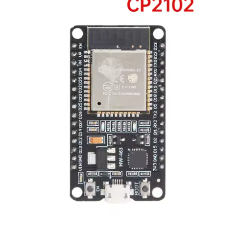

# Proyecto de Test ESP32

Este proyecto es una prueba simple para verificar el funcionamiento básico de una placa ESP32. Realiza dos funciones principales: parpadeo de un LED y comunicación serie.

## Funcionalidades

1.  **Parpadeo de LED**: Controla un LED conectado al pin GPIO 2 (comúnmente el LED integrado en muchas placas ESP32). El LED se enciende por 1 segundo y se apaga por 1 segundo.
2.  **Salida Serial**: Envía el mensaje "Adios mundo cruel" a través del puerto serie cada 2 segundos.

## Requisitos

### Hardware
*   Placa de desarrollo ESP32.
*   LED conectado al pin 2 (o usar el LED integrado si corresponde al GPIO 2).
*   Cable USB para programación y alimentación.

### Software
*   Arduino IDE (o VS Code con extensión Arduino).
*   Drivers para el chip USB-UART de tu placa (CP210x, CH340, etc.).
*   Paquete de tarjetas ESP32 instalado en el Gestor de Tarjetas de Arduino.

## Configuración y Uso

1.  Abre el archivo `testARDUNO.ino` en tu entorno de desarrollo.
2.  Conecta la placa ESP32 al ordenador.
3.  Selecciona el modelo correcto de tu placa ESP32 y el puerto COM correspondiente.
4.  Sube el código a la placa.
5.  Abre el Monitor Serie y configúralo a **9600 baudios**.

## Resultado Esperado

*   El LED en el pin 2 parpadeará continuamente.
*   En el Monitor Serie verás aparecer el mensaje repetidamente.
